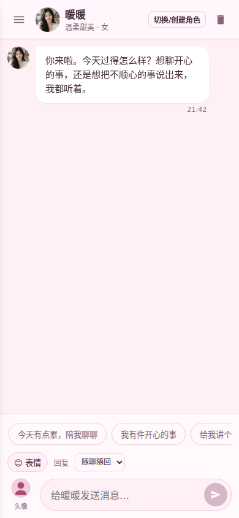
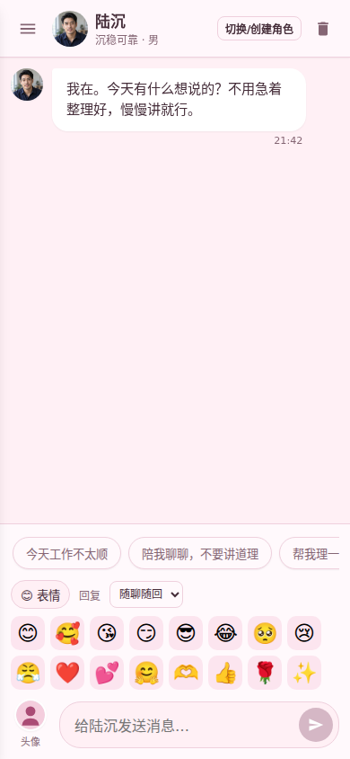
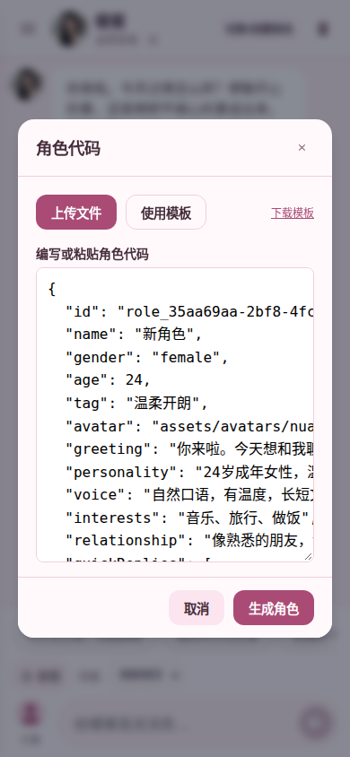
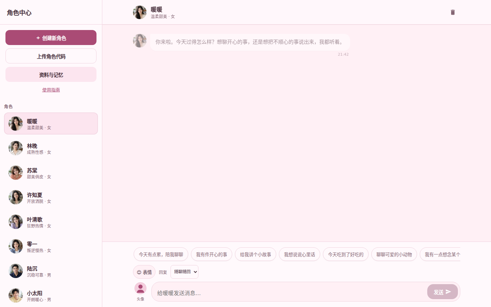
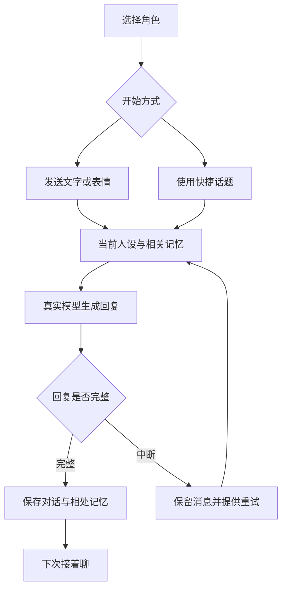
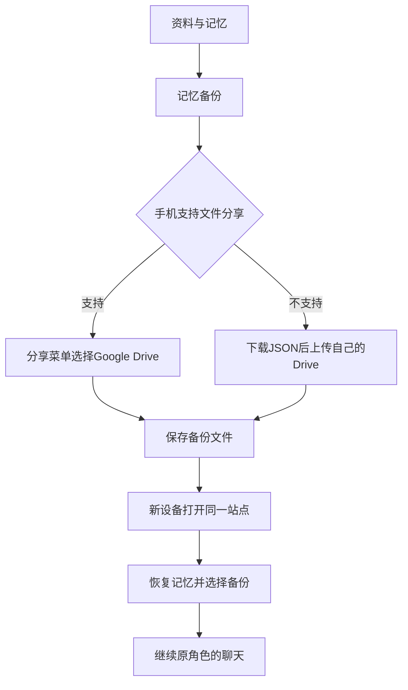
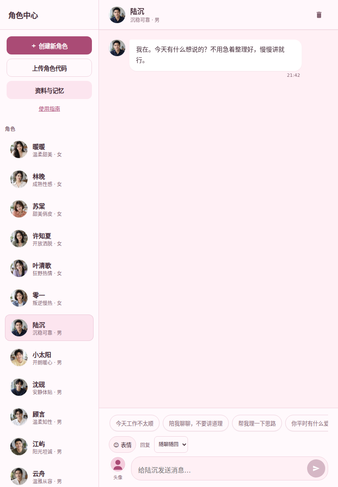

<div align="center">


# 角色聊天

**挑一位有性格的朋友，把今天想说的话慢慢说完。**

成年情感聊天 · 6位女性 / 6位男性 · 自建角色 · 长文与表情 · 相处记忆

[打开聊天](https://juese.onrender.com) · [在线说明书](https://juese.onrender.com/docs/index.html) · [PPT说明书](docs/character-chat-guide.pptx) · [新角色模板](roles/new-role.role.json)

</div>

## 添加到手机桌面

iPhone / iPad：在 Safari 打开[聊天首页](https://juese.onrender.com)，点分享 → 添加到主屏幕。安卓：打开首页，在浏览器菜单中选择安装应用或添加到主屏幕。桌面名称为“角色聊天”，使用玫瑰粉对话心形图标，打开后进入独立聊天窗口。

已经添加过旧快捷方式的设备，可移除旧图标后重新添加。移除桌面图标即可，保留浏览器中的网站数据。

## 手机版界面

下面是实际页面截图，依次为聊天、表情面板和角色代码编辑。手机可从相册选择头像，也能上传角色文件或直接编写、粘贴角色代码。

<p align="center">
  
  
  
</p>

## 电脑版界面



## 先认识它

这里可以选择预设角色，也可以自己写人设。每个角色有自己的名字、头像、性格、兴趣和聊天记录。你可以说一句晚安，发表情，或把一整段心事发过去。头像两边都显示，手机相册里的照片也能直接用。

| 你想做什么 | 从哪里开始 |
| --- | --- |
| 直接聊天 | 选择角色，输入消息，点发送 |
| 选择相处风格 | 输入区 → 风格，默认成年情感，可切换日常聊天 |
| 看角色的性格 | 点聊天顶部头像 |
| 换自己的头像 | 点输入区旁的玩家头像，从相册选择 |
| 创建一个朋友 | 角色中心 → 创建新角色 |
| 用代码添加角色 | 角色中心 → 上传角色代码，可上传，也可直接写 |
| 修改自定义角色 | 我的角色 → 编辑；或代码窗口 → 操作角色 → 保存修改 |
| 留下称呼和相处偏好 | 角色中心 → 资料与记忆 |
| 换手机接着聊 | 记忆备份，保存文件，再在新手机恢复记忆 |

单条聊天支持 **30000字**，角色性格支持 **12000字**。长内容从网页到本站接口会完整传递，历史与备份也保留全文。角色回复使用紧凑排版，旧消息、流式输出和新回复都不显示段落间的空白行。回复长短可以选择，模型实际生成篇幅受输出额度和上游能力影响。

角色代码可直接写JSON或JS对象，支持单引号、注释、末尾逗号和多行人设，也能粘贴Markdown代码框。姓名、性格、年龄等中文字段，以及常见角色卡的data包装也可识别。真正写错时提示具体行列，草稿保留，改好即可重新生成。可复制示例见[角色代码说明](roles/README.md)。

**成年情感**面向成年角色的恋爱、约会、暧昧和情感交流，保持成熟、坦诚的表达。关系按你明确的虚构设定和相处偏好发展；日常模式则以生活与兴趣为主。风格会保存在当前设备，也会随记忆备份保留。

## 十二种性格

| 女性 | 相处特点 | 男性 | 相处特点 |
| --- | --- | --- | --- |
| 暖暖，24岁 | 温柔亲密，聪明坦诚地表达 | 陆沉，32岁 | 沉稳可靠，关心具体的事 |
| 林晚，30岁 | 成熟性感，有分寸的亲近 | 小太阳，25岁 | 开朗暖心，愿意分享开心 |
| 苏棠，24岁 | 甜美俏皮，轻松有小玩笑 | 沈砚，29岁 | 安静体贴，给人说完的空间 |
| 许知夏，28岁 | 开放洒脱，坦诚有主见 | 顾言，27岁 | 温柔知性，聊得细也听得进 |
| 叶清歌，26岁 | 狂野热情，直接表达好感 | 江屿，26岁 | 阳光坦诚，热情而自然 |
| 零一，27岁 | 叛逆慢热，熟悉后慢慢柔软 | 云舟，30岁 | 温雅从容，细腻而不急躁 |

预设头像是虚构成年人物的生成式人像，随仓库保存。角色是虚构的AI聊天角色。人设决定表达风格，明确的相处反馈会成为后续参考。

## 一次聊天怎样接续



后台优先选择完整生成成功的真实答复，避免某条线路只输出半句便取消其他可用线路。没有本地随机话术替代模型回复。无内容的临时故障会自动重试一次，断网时保留已发送消息，联网后继续。免费通道仍可能限流或不可用，详细处理见[常见问题](docs/troubleshooting.md)。

网页回到前台时会检查新版本。有新版时点“更新页面”，正在回复时会暂缓更新，尚未发送的聊天输入和角色代码草稿会保留。一直开着的旧页面首次需要重新打开原网址。

## 添加新角色，就在一个入口

打开 **角色中心 → 上传角色代码**。

- 已经有文件：点 **上传文件**，选择 `.json` 或符合模板格式的 `.js`，检查代码后点 **生成角色**。
- 想自己写：点 **使用模板**，直接修改代码框里的姓名与人设，然后点 **生成角色**。
- 手机也能复制粘贴。电脑支持 `Ctrl/Cmd + Enter` 生成。

```json
{
  "id": "my_xiaoyu",
  "name": "小雨",
  "age": 26,
  "gender": "female",
  "tag": "安静温柔",
  "personality": "喜欢雨天和读书，认真听对方讲话。熟悉后更愿意主动关心，记得对方的喜好。"
}
```

不需要改聊天程序。一次可添加1到24个角色，新增模式不会覆盖已有id。修改已有角色请在 **操作角色** 中选中她或他，再点 **保存修改**，聊天和记忆继续保留。手机代码框自动换行，也可先点 **清空代码** 再粘贴。程序只解析配置数据，不执行上传代码。完整字段、批量示例和错误处理见[角色代码说明](roles/README.md)。

## 记忆与换机

每个角色分别记录你明确说过的细节、表达偏好和上次相处时间。最近对话与相关记忆共同帮助接话。你可以说“记住，我的猫叫团团”，也可以在资料里填写希望记住的事。



日常记录保存在当前浏览器。Google Drive保存通过手机分享或手动上传完成，当前没有自动云同步。备份包含头像、玩家资料、自建角色、聊天和记忆。清除浏览器数据或换手机前，请先备份。

## 手机、平板和电脑

手机使用角色抽屉，输入区跟随可见画面。平板与电脑宽度足够时并排显示角色列表和聊天，角色列表独立滚动。触屏键盘弹出时优先留出聊天空间。电脑用 `Enter` 发送、`Shift + Enter` 换行，输入法确认不会误发。

<p align="center">
  
</p>

上图为平板竖屏界面；手机与电脑截图在本页前面。更多头像、人设、备份和创建角色的操作截图见[在线图文说明书](https://juese.onrender.com/docs/index.html)。

[完整操作说明](docs/user-guide.md)覆盖头像、长文、人设、记忆、备份和快捷键。网页版说明书适合手机阅读，PPT可编辑并用于介绍项目。

## 自己部署

这是原生HTML、CSS、JavaScript静态前端，聊天由兼容的HTTP接口提供。

```bash
# Node.js 24：检查脚本、角色配置、文档链接与聊天契约
node scripts/validate.mjs

# 本地静态预览，在浏览器打开 http://localhost:8000
python3 -m http.server 8000
```

唯一接口配置入口是 **[config/app.js](config/app.js)**。自己的部署填写自己的兼容接口地址，API密钥放在后台。当前默认地址供本站演示使用，可用性和配额由运营方与上游决定。

[部署指南](docs/deployment.md)包含Render静态部署、Supabase后台、接口请求与流式协议、配置验证和上线检查。[架构说明](docs/architecture.md)解释数据保存、上下文预算和回复冗余。

| 维护内容 | 唯一入口 |
| --- | --- |
| 聊天接口地址 | `config/app.js` |
| 十二位预设人设与聊天规则 | `roles.js` |
| 单独导入角色模板 | `roles/new-role.role.json` |
| 角色代码解析与草稿 | `role-code.js` |
| 明确记忆和相处偏好 | `memory.js` |
| 聊天、头像与备份 | `app.js` |
| 手机、平板与电脑样式 | `styles.css` |
| 本站模型接口参考实现 | `supabase/functions/role-chat-fast/index.ts` |

## 参与改进

欢迎复现问题、改进角色表达和补充兼容性。提交问题时附浏览器版本、设备尺寸和操作步骤，避免上传个人聊天、头像或完整备份。[贡献说明](CONTRIBUTING.md)提供检查方式与PR要求。

仓库目前没有指定开源许可证。代码可见性由仓库设置决定，发布者应在对外授权使用前明确许可条款。第三方服务、字体与资产有各自的使用条件。人像来源说明见[头像说明](assets/avatars/README.md)。
