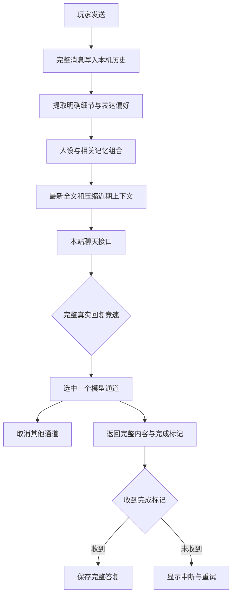

# 架构与数据说明

## 文件职责

| 文件 | 职责 |
| --- | --- |
| index.html | 页面结构、弹窗与可访问控件 |
| config/app.js | 唯一聊天接口地址 |
| styles.css | 浅粉色样式、屏幕适配、可见视口布局 |
| roles.js | 12个预设、聊天风格与情境规则 |
| role-code.js | JSON解析、模板、文件导入和同标签页草稿 |
| memory.js | 明确自述、表达偏好与相关记忆选取 |
| app.js | 生命周期、角色状态、头像、请求、聊天和备份 |
| supabase/functions/role-chat-fast/index.ts | 请求压缩、真实通道竞速与SSE转发 |
| roles/ | 玩家可独立导入的模板和说明 |
| docs/ | 说明书、架构、故障处理和PPT |
| scripts/ | 可复现的检查入口 |

旧config/role.json保留作历史参考，不是当前预设或接口配置入口。

## 一条消息的数据路径

网站不提前展示随机句子模拟回复。只有完整有效的真实内容能赢得竞速，第一段随后断流时仍保留其他线路的机会。模型真实的边界答复也正常显示，不会被关键词过滤成连接失败。无内容时可以自动再试一次。各角色有独立请求，切换角色不改变回复归属。清空或删除会取消请求，迟到结果不会写回。

连接预热使用不带玩家资料的GET检查。聊天POST仍传递完整JSON正文，使用text/plain类型以减少跨域预检等待。收到done即结束本轮并保存有效答复，不等连接关闭；完成之后的清理或迟到错误不会把成功回复改成失败。真正中断的部分内容仍显示重试入口，不写入正式回复历史。

普通通道首批预算12秒、完整预算17秒，前端总预算40秒，涵盖一次无内容重试。长通道首批预算12秒、完整预算90秒，前端总预算100秒。后台在等待完整内容时每5秒发送不含聊天正文的连接心跳；实际显示回复的时间取决于网络与上游。

version.json和app.js的SITE_VERSION共同标记网页版本。回到前台时检查更新，更新按钮先保护进行中的回复并保存聊天输入及角色代码草稿。后台诊断记录完整成功的线路、时长、字符数或失败类别，不记录用户消息或人设。

## 本机保存键

| localStorage键 | 内容 |
| --- | --- |
| liaotian_custom_chars | 自建角色、人设与头像 |
| liaotian_chat_histories | 各角色的完整聊天历史 |
| liaotian_active_char | 当前角色 |
| liaotian_user_avatar | 玩家头像 |
| liaotian_player_profile | 稳定玩家id、称呼与资料 |
| liaotian_role_memories | 按角色保存的事实、偏好与相处时间 |
| liaotian_reply_length | 回复长度选择 |

角色代码草稿使用sessionStorage键liaotian_role_code_draft。日常保存范围是当前域名、当前浏览器和当前设备。请求只带必要的文字上下文，不发送头像图片或完整备份。

图片在浏览器内裁剪压缩为384像素JPEG。预设图片来自站点文件，不依赖外部头像网址。用户主动配置的HTTPS头像可能由外部服务器加载。

## 记忆的边界

玩家资料的称呼最多24字符，资料与相处偏好编辑框各600字符。每个角色保存80条事实和16条偏好，再按本轮相关性挑选部分带入。姓名、宠物等身份细节优先参考，较新的反馈优先于相反旧反馈。

模型的本轮上下文不是全部永久历史。最新30000字符完整发送，旧消息总预算12000字符，每条1600字符，最多20条。人设、规则与相关记忆总上限24000字符。完整本机历史不会随此预算裁剪。

“自学习”指明确事实与表达偏好的持续保存和提示词调整。当前没有模型训练、自动Google云同步或后台主动发送消息。

## 备份格式

版本1使用format为liaotian123-backup，包含profile、userAvatar、characters、histories、memories以及时间和选项。导入只接受识别的格式。聊天按消息id去重，记忆合并去重，同id角色保护已有设定。备份包含私人内容，请由玩家自行保管。

## 维护原则

给所有设备保留同一套实际功能，不用假UI代替真实能力。角色扩展通过固定代码入口完成。界面以聊天为主，容量、上游与保存细节放在说明书。网页与后台容量必须一起调整，备份恢复和真实模型验证也要覆盖长文末尾。
